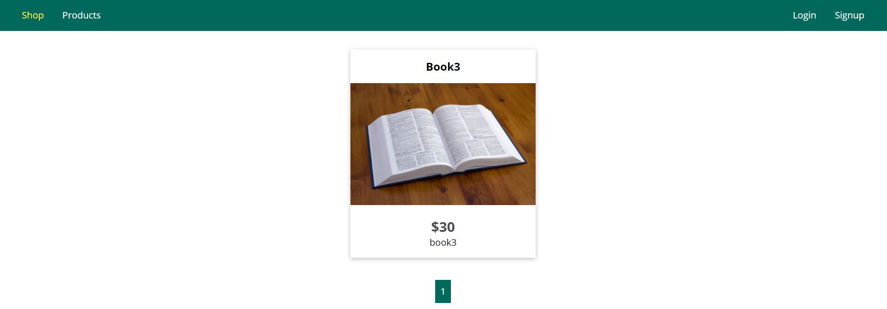
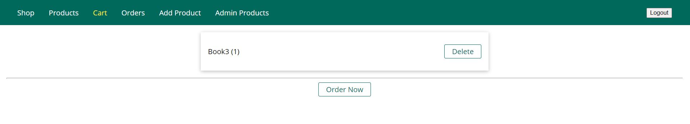
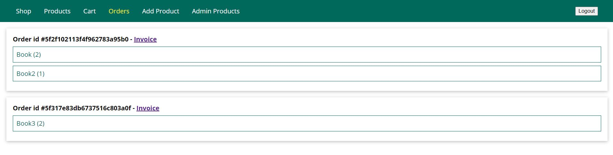
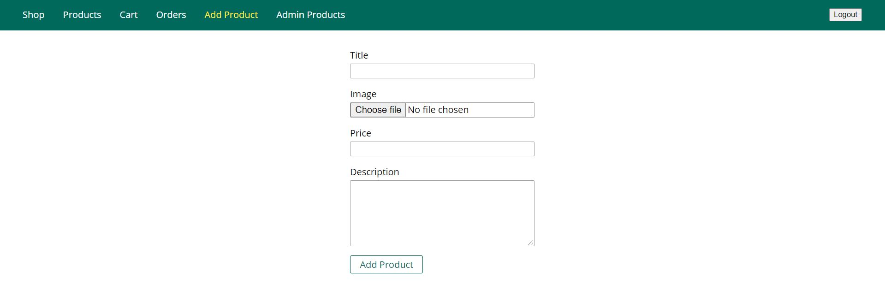
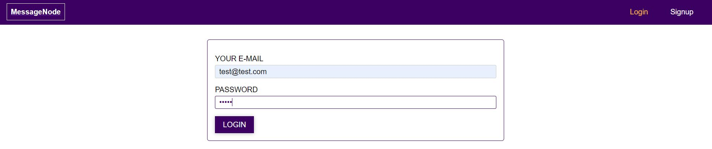
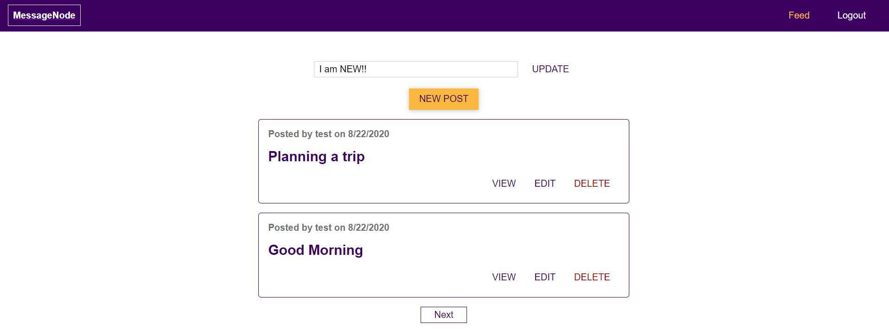
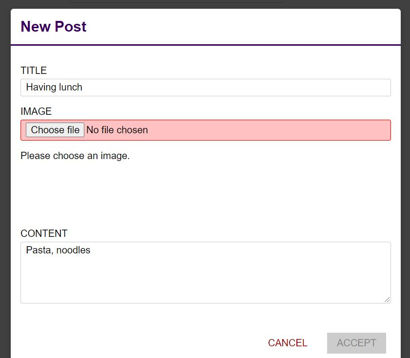

# nodejs-boot-camp

# nodejs-basics

Basic Node Http Server

# expressjs-basics

Express Web app

- Template Engines - pug, ejs, handlebars
- Routes, Models, Controllers

# shopping-app-expressjs-sequelize

Shopping app using expressjs, MySQL DB, sequelize

# shopping-app-expressjs-mongodb

Shopping app using expressjs, MongoDB, Mongoose

- Templating engine - ejs
- Handled Authentication, Session
- PDF invoice using pdfkit library
- Third party libraries - multer, helmet, compression, morgan, csurf, connect-flash, connect-mongodb-session, express-validator/check, bcryptjs, crypto, nodemailer

Home Page:

Cart page:

Orders Page:

Add Products page:

# social-network-app

Social Network app using expressjs rest api and reactjs UI.

### expressjs-rest-api

- Handled Authentication using JWT
- Websocket for real time feeds using socket.io
- Third party libraries - multer, mongoose, bcrypt, jsonwebtoken
- Unit Testing - Mocha, Chai and Sinon

### reactjs-frontend

Login page:

Home page:

Add Post page:

# social-network-app-graphql

Social Network app using GraphQL server and reactjs UI.

### expressjs-graphql-server

- Handled Authentication using JWT
- Used graphql, express-graphql
- Other Third party libraries - multer, mongoose, bcrypt, jsonwebtoken
- Unit Testing - Mocha, Chai and Sinon

### reactjs-frontend

# nodejs-typescript

Used Typescript with Nodejs
